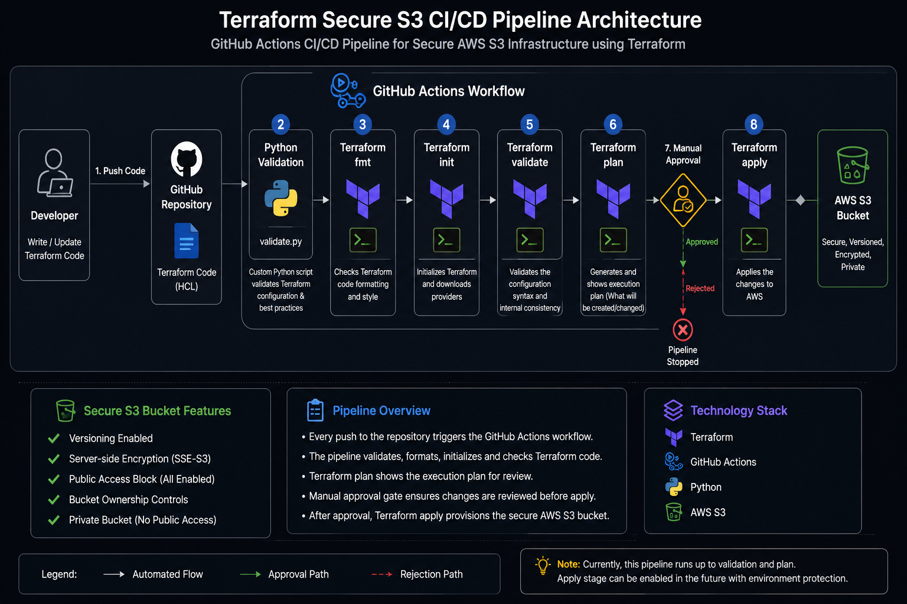

# Terraform Secure S3 CI/CD Pipeline

[](https://github.com/Fadila-Yiddana/terraform-secure-s3-cicd-pipeline/actions/workflows/terraform.yml)

## Project Overview

This project demonstrates how to build a production-style Continuous Integration (CI) pipeline for Terraform using GitHub Actions and Python while provisioning secure AWS infrastructure.

The pipeline automatically validates Infrastructure as Code before deployment by performing Python validation, Terraform formatting checks, initialization, and configuration validation.

The infrastructure created in this project follows AWS security best practices by enabling:

- Server-side encryption
- Bucket versioning
- Public access block
- Bucket ownership controls

---

## Architecture

<p align="center">
  
</p>

**> Diagram represents my implementation of a GitHub Actions CI/CD pipeline for Terraform infrastructure. Created and customized as part of my DevOps project.

---

## Technologies Used

- Terraform
- GitHub Actions
- Python
- AWS S3
- Git
- Infrastructure as Code (IaC)

---

## Project Structure

```text
terraform-secure-s3-cicd-pipeline/
│
├── .github/
│   └── workflows/
│       └── terraform.yml
│
├── python/
│   └── validate.py
│
├── terraform/
│   ├── versions.tf
│   ├── providers.tf
│   ├── variables.tf
│   ├── main.tf
│   └── outputs.tf
│
├── diagrams/
├── NOTES.md
└── README.md
```

---

## CI/CD Workflow

The GitHub Actions pipeline automatically performs the following checks whenever code is pushed to the repository:

1. Checkout repository
2. Setup Python
3. Run Python validation
4. Setup Terraform
5. Terraform Format Check
6. Terraform Initialize
7. Terraform Validate

Only validated Infrastructure as Code proceeds through the pipeline.

---

## AWS Security Features

The deployed infrastructure includes:

- Amazon S3 Bucket
- Bucket Versioning
- Server-side Encryption (AES256)
- Public Access Block
- Bucket Ownership Controls

---

## Skills Demonstrated

- Terraform
- AWS S3
- GitHub Actions
- CI/CD
- Python Automation
- Infrastructure as Code
- Cloud Security
- Git
- DevOps

---

## Future Improvements

- Remote Terraform State
- DynamoDB State Locking
- Multi-environment deployments
- Terraform Plan artifacts
- Automated deployment approvals
